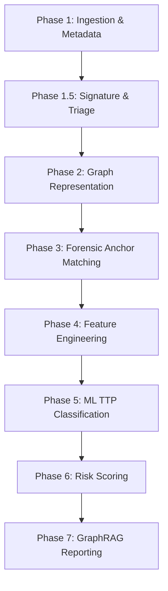

# GuardGraph AI — Project Handoff & Completed Status

This document provides a comprehensive summary of the current architecture, implementation status, and recent changes in **GuardGraph AI** for LLMs (like Claude) picking up work on this codebase.

> **This file predates 2026-08-22.** For the reverse-engineering deep dive (reflection/crypto/DCL/
> WebView/native resolution), manifest/ZIP anti-analysis resilience, Neo4j graph correlation (MITRE
> mapping / correlated samples / certificate reuse / live Threat Landscape view), and GraphRAG
> anti-fabrication hardening added since — including what does and doesn't actually work, verified
> live — see **`TEAM_CONTEXT.md`'s "Session 12"** entry, the current source of truth.

---

## 1. What is GuardGraph AI?
**GuardGraph AI** is a static-analysis-only Android malware detection and risk-scoring engine designed specifically for **banking fraud threats** (trojans, SMS interception, credential harvesting, etc.). It uses:
- **Control Flow Graphs (CFGs)** and **Attributed CFGs (ACFGs)** parsed via Androguard and represented in NetworkX.
- **Graph-topological features** (closeness, centrality, clustering) that are invariant under standard code obfuscation.
- **YARA rules and local/online signature triage** to detect known malware threats early.
- **A multi-label XGBoost classifier** that directly predicts MITRE ATT&CK Mobile TTPs.
- **Neo4j knowledge graph** storing mobile threat intelligence (MITRE ATT&CK / CAPEC).
- **A GraphRAG report generator** running on a local Ollama instance (`qwen2.5:7b-instruct-q4_K_M`) to produce analyst-readable, evidence-grounded reports.

---

## 2. Core Architecture & Pipeline Phases
The analysis engine is structured as a modular, phase-based pipeline in [pipeline.py](file:///app/core/pipeline.py) and called by [routes.py](file:///app/api/routes.py):



- **Phase 1: Ingestion & Metadata Extraction**: Computes SHA-256 hash, extracts signing cert thumbprint, and parses Android Manifest (permissions, components, intent actions).
- **Phase 1.5: Signature & Online Triage**: Checks local hash/cert DB, scans against VirusTotal API v3 and MalwareBazaar, and runs YARA scanning (8 built-in rules + 455 community rules).
- **Phase 2: Graph Representation (CFGs & ACFGs)**: Builds control flow graphs per method.
- **Phase 3: Forensic Anchor Matching & Subgraphs**: Matches forensic dictionary against CFGs and extracts 4-hop subgraphs around matched sensitive nodes.
- **Phase 4: Feature Engineering**: Computes topological invariants across behavioral subgraphs and extracts obfuscation indicators (entropy, flattening z-score, parse failure rates).
- **Phase 5: ML TTP Classification**: Runs direct multi-label TTP classification (Binary Relevance XGBoost, predicting 57 ATT&CK Mobile techniques).
- **Phase 6: Risk Scoring & Verdict**: Evaluates the risk formula and labels zero-day indicators.
- **Phase 7: GraphRAG Reporting**: Fetches ontology context from Neo4j and calls the local Ollama LLM to format the final narrative report.

---

## 3. Recently Completed Implementations

### Session 4: Signature Detection + YARA + Online Triage (July 16, 2026)
- **Local DB & Online Lookup**: Implemented local hash/cert matching DB (`known_hashes.json`) for known families (Anubis, TeaBot, etc.) + VirusTotal v3 and MalwareBazaar lookup.
- **YARA scanning**: Integrated 8 built-in banking rules + 455 community rules downloaded from `Yara-Rules/rules` (with automatic skipping of malformed/unsupported rules).
- **Feature Vector Expansion**: Expanded the family model's feature vector from **30 to 33 features** to include `signature_match_count`, `yara_rule_match_count`, and `yara_max_severity`.
- **Scoring Boosts**: Tied local/VT signature hits to `reputation_component` and YARA rule matches to `ioc_component`.

### Session 5: Multi-label MITRE ATT&CK TTP Classifier + Zero-Day Engine (July 16, 2026)
- **Ontology Loading**: Built a full STIX-derived MITRE ATT&CK Mobile ontology with 57 parent techniques (loaded via `scripts/load_ontology.py` into Neo4j).
- **Features & intent action vocabulary**: Added `TTP_FEATURE_NAMES` (**179 features**) in `features.py` containing a binary presence vocabulary of 92 permissions, 25 intent actions, 32 sensitive APIs, 3 component counts, behavior flags, topology metrics, and triage stats.
- **Dataset builder**: Created `scripts/build_ttp_dataset.py` implementing a hybrid staged dataset (Stage A: MalwareBazaar downloads + Stage B: local weak-labelling of CICMalDroid2020 via behaviors).
- **Binary Relevance model**: Implemented `BinaryRelevanceXGB` (one model per technique) in `app/ml/classifier.py`, trained via `scripts/train_model.py --target ttp`.
- **Zero-Day Indicator**: Configured `RiskScoreBreakdown.zero_day_indicator` which flags samples having strong forensic/structural evidence but low classifier confidence.

---

## 4. Current Status: Real vs. Stubbed

| Module / Component | State | Notes |
|---|---|---|
| **FastAPI server** | ✅ Real | Running on port `8001` |
| **Androguard Ingestion** | ✅ Real | Hashing, certificate, manifest, intent extraction working |
| **Local + Online Triage** | ✅ Real | Signatures + YARA + VT/MalwareBazaar lookup fully wired |
| **CFG & ACFG Pipeline** | ✅ Real | Graph extraction (NetworkX) and topological calculation working |
| **Neo4j Cache & Ontology** | ✅ Real | Schema loaded, starter and full ontology loaders working |
| **Multi-label TTP model** | ⚠️ Stubbed | Code, inference, and training script are implemented; needs a retrained `.joblib` model file at `data/models/guardgraph_ttp_br_v1.joblib` |
| **Auxiliary Family model** | ⚠️ Stubbed | Pipeline degrades gracefully without predictions until a model is placed at `data/models/guardgraph_xgb_v1.json` |
| **GraphRAG Reporting** | ✅ Real | Swapped to local Ollama (`qwen2.5:7b-instruct-q4_K_M` GGUF) via OpenAI-compat API |
| **Reflection / Native Code** | ❌ Stubbed / Out | Out of scope for the prototype phase |

---

## 5. Setup & How to Run

### Requirements & Environment
The `.env` file should configure:
```ini
NEO4J_URI=bolt://localhost:7687
NEO4J_USER=neo4j
NEO4J_PASSWORD=changeme
OLLAMA_BASE_URL=http://localhost:11434/v1
OLLAMA_MODEL=qwen2.5:7b-instruct-q4_K_M
VIRUSTOTAL_API_KEY=your_key_here  # Optional (fallback is logged)
```

### Running the Services
1. **Start Neo4j**:
   ```bash
   docker compose up -d
   ```
2. **Load Ontology**:
   ```bash
   .venv/bin/python scripts/load_ontology.py
   ```
3. **Pull local model**:
   ```bash
   ollama pull qwen2.5:7b-instruct-q4_K_M
   ```
4. **Start API**:
   ```bash
   .venv/bin/uvicorn app.main:app --host 127.0.0.1 --port 8001
   ```
5. **Run test upload**:
   ```bash
   .venv/bin/python scripts/test_upload.py --file data/samples/ApiDemos-debug.apk
   ```

### Running Tests
- **Pipeline Phases**: `.venv/bin/python -m unittest tests/test_pipeline_phases.py`
- **Signatures & YARA**: `.venv/bin/python -m unittest tests/test_signatures_yara.py`
- **Features Invariance**: `.venv/bin/python -m unittest tests/test_features.py`
