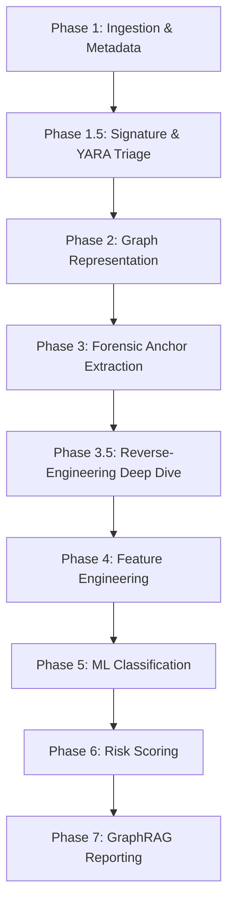

# GuardGraph AI — Processing Phases

This document describes the 9 sequential static analysis execution phases that construct the processing pipeline in the cold path.

## Phase Descriptions

### Phase 1: Ingestion & Metadata Extraction
- **Module**: `app/analysis/ingest.py`
- **Actions**: Computes SHA-256 hash of the APK file, extracts certificate thumbprints, and parses the Android Manifest file to read permissions, activities, services, and receivers.
- **Trigger**: Called in both hot and cold paths.

### Phase 1.5: Signature & YARA Triage
- **Modules**: `app/analysis/signatures.py`, `app/analysis/yara_engine.py`
- **Actions**: Matches the SHA-256 and signing-certificate thumbprint against the local known-malware DB, optionally queries VirusTotal and MalwareBazaar (gated on `ONLINE_LOOKUPS_ENABLED` and an API key), and runs YARA over the APK plus the uncompressed inner DEX/asset byte streams so ZIP compression cannot hide a match.

### Phase 2: Graph Representation
- **Module**: `app/analysis/cfg.py`
- **Actions**: Builds Control Flow Graphs (CFGs) for each class method using Androguard and represents them in memory as NetworkX directed graphs, enriching nodes with Attributed CFG (ACFG) features.

### Phase 3: Forensic Anchor Extraction
- **Module**: `app/analysis/forensic.py`
- **Actions**: Scans the method CFGs against the forensic dictionary to identify sensitive "anchor" APIs (e.g. BroadcastReceivers, SMS interception calls) and extracts 4-hop subgraphs around these anchor nodes.

### Phase 3.5: Reverse-Engineering Deep Dive
- **Modules**: `app/analysis/static_resolution.py`, `crypto_recovery.py`, `dcl_tracing.py`, `webview_bridge.py`, `native_bridge.py`
- **Actions**: Propagates register constants within each method to resolve what obfuscated call sites actually reach — reflection targets, cipher transformations (flagging weak modes), `DexClassLoader` payload paths cross-referenced against the flagged asset inventory, `addJavascriptInterface` bridge names, and `System.loadLibrary` targets correlated with the `.so`'s ELF dynamic symbol table. Anything that does not trace back to a literal is reported unresolved rather than guessed.

### Phase 4: Feature Engineering
- **Module**: `app/analysis/topology.py` and `app/analysis/obfuscation.py`
- **Actions**: Computes topological invariants (degree, closeness, and clustering metrics) for the behavioral subgraphs and extracts obfuscation indicators (Shannon entropy, z-scores for control-flow flattening, and parse failure rates).

### Phase 5: Machine Learning Classification
- **Module**: `app/ml/classifier.py`
- **Actions**: Feeds the compiled feature vector into the XGBoost classifier to predict the threat/malware family (e.g., banker, rat) and maps the classification to MITRE ATT&CK Mobile techniques.

### Phase 6: Risk Scoring
- **Module**: `app/reports/scoring.py`
- **Actions**: Computes the weighted risk score formula (0–100) and maps the sample to its final verdict band (Low, Suspicious, High, Malicious).

### Phase 7: GraphRAG Reporting
- **Module**: `app/reports/graphrag.py`
- **Actions**: Queries Neo4j for predicted TTPs, retrieves ATT&CK/CAPEC details, and formats this grounded data to generate an analyst report via a local Ollama model (Qwen 2.5 7B-Instruct).
