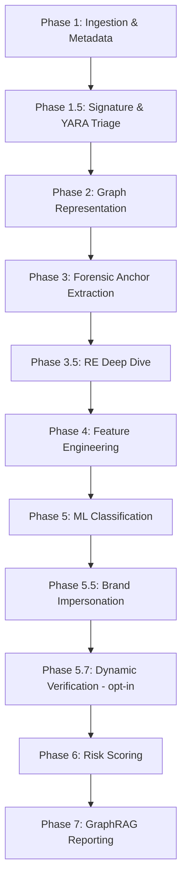

# GuardGraph AI — Processing Phases

This document describes the sequential execution phases in the cold path — mostly static analysis,
plus one opt-in dynamic phase (5.7) added 2026-08-24 (see `TEAM_CONTEXT.md` Session 14).

## Phase Descriptions

### Phase 1: Ingestion & Metadata Extraction
- **Module**: `app/analysis/ingest.py`
- **Actions**: Computes SHA-256 hash of the APK file, extracts certificate thumbprints, and parses the Android Manifest file to read permissions, activities, services, and receivers.
- **Trigger**: Called in both hot and cold paths.

### Phase 1.5: Signature & YARA Triage
- **Modules**: `app/analysis/signatures.py`, `app/analysis/yara_engine.py`
- **Actions**: Matches the SHA-256 and signing-certificate thumbprint against the local known-malware DB, optionally queries VirusTotal and MalwareBazaar (gated on `ONLINE_LOOKUPS_ENABLED` and an API key), and runs YARA over the APK plus the uncompressed inner DEX/asset byte streams so ZIP compression cannot hide a match.

### Phase 2: Graph Representation
- **Module**: `app/analysis/cfg.py`
- **Actions**: Builds Control Flow Graphs (CFGs) for each class method using Androguard and represents them in memory as NetworkX directed graphs, enriching nodes with Attributed CFG (ACFG) features.

### Phase 3: Forensic Anchor Extraction
- **Module**: `app/analysis/forensic.py`
- **Actions**: Scans the method CFGs against the forensic dictionary to identify sensitive "anchor" APIs (e.g. BroadcastReceivers, SMS interception calls) and extracts 4-hop subgraphs around these anchor nodes.

### Phase 3.5: Reverse-Engineering Deep Dive [NEW Session 12]
- **Module**: `app/analysis/static_resolution.py`, `crypto_recovery.py`, `dcl_tracing.py`, `webview_bridge.py`, `native_bridge.py`, `app/core/pipeline.py::run_phase3b_re_deepdive`
- **Actions**: Runs the shared register-constant propagation engine (also used by `obfuscation.py`'s reflection resolution) against the CFGs to resolve `Cipher.getInstance`/`SecretKeySpec` crypto configs, `DexClassLoader` dynamic-loading targets, `addJavascriptInterface` WebView bridges, and `System.loadLibrary` + JNI native symbol correlation — all static, no execution.

### Phase 4: Feature Engineering
- **Module**: `app/analysis/topology.py` and `app/analysis/obfuscation.py`
- **Actions**: Computes topological invariants (degree, closeness, and clustering metrics) for the behavioral subgraphs and extracts obfuscation indicators (Shannon entropy, z-scores for control-flow flattening, and parse failure rates).

### Phase 5: Machine Learning Classification
- **Module**: `app/ml/classifier.py`
- **Actions**: Feeds the compiled feature vector into the XGBoost classifier to predict the threat/malware family (e.g., banker, rat) and maps the classification to MITRE ATT&CK Mobile techniques.

### Phase 5.5: Brand Impersonation Checks
- **Module**: `app/analysis/impersonation.py`, `app/core/pipeline.py::run_phase5b_impersonation`
- **Actions**: Answers a different question than every other phase — "is this app pretending to be a
  different, legitimate app?" rather than "how malicious does the code look?". Checks the current
  sample's package name / display label / launcher icon / signing certificate against
  `data/reference/protected_brands.json` (65 brands as of 2026-08-24) for certificate mismatch, icon
  reuse, package typosquatting, and label impersonation. A match raises a **floor** under the verdict
  rather than adding to the weighted score (`IMPERSONATION_SCORE_FLOOR` in `scoring.py`).

### Phase 5.7: Dynamic Verification [NEW Session 14, 2026-08-24 — opt-in, off by default]
- **Module**: `app/analysis/dynamic_verification.py`, `app/analysis/frida_scripts/`,
  `app/core/pipeline.py::run_phase8_dynamic_verification`
- **Actions**: Only runs when the request explicitly passes `enable_dynamic=true` AND
  `settings.dynamic_analysis_enabled` is on (both default off — never affects the default path's speed
  or behavior). Installs the APK on a locally-running, network-egress-isolated Android emulator (AVD),
  launches it (falling back to broadcasting its own declared intent-filter actions if it has no
  launcher activity — common for headless/receiver-only malware), attaches Frida, injects a simulated
  inbound SMS + synthetic taps as stimuli, and hooks 13 APIs for a bounded capture window (network
  connects, SMS send/intercept, DexClassLoader execution, accessibility binding, crypto invocation,
  overlay-attack windows, native library loads, contacts/call-log/clipboard reads, URLs/files/commands).
  Each hook diffs against a specific static prediction already made earlier in the pipeline (C2
  indicators, DCL targets, native library targets) to produce a CONFIRMED/REFUTED/not-observed verdict
  per signal, plus up to 3 screenshots (reaction / event-triggered / final) and a crash-logcat capture
  if the target self-terminates mid-run. See `TEAM_CONTEXT.md` Session 14 for the full design writeup
  and `app/analysis/frida_scripts/README.md` for the containment setup required before enabling this.

### Phase 6: Risk Scoring
- **Module**: `app/reports/scoring.py`
- **Actions**: Computes the weighted risk score formula (0–100) and maps the sample to its final verdict band (Low, Suspicious, High, Malicious).

### Phase 7: GraphRAG Reporting
- **Module**: `app/reports/graphrag.py`
- **Actions**: Queries Neo4j for predicted TTPs, retrieves ATT&CK/CAPEC details, and formats this grounded data to generate an analyst report via a local Ollama model (Qwen 2.5 7B-Instruct).
